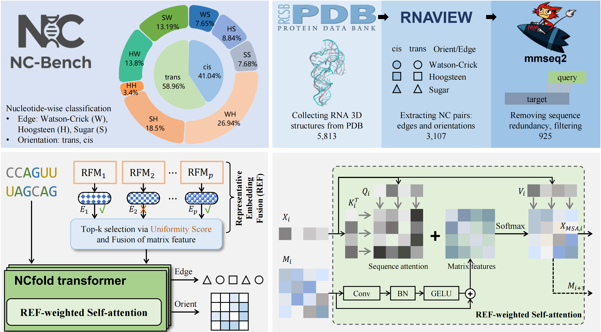

<p align="center">

  <h1 align="center">NC-Bench and NCfold<br> for RNA non-canonical base pair prediction</h1>
  <div align="center">
    
  </div>
</p>


<!-- vim-markdown-toc GFM -->

* [Introduction](#introduction)
* [Installation](#installation)
    * [Requirements](#requirements)
    * [Instructions](#instructions)
* [Usage](#usage)
    * [NCBench dataset](#ncbench-dataset)
    * [NCfold training](#ncfold-training)
* [LICENSE](#license)

<!-- vim-markdown-toc -->

## Introduction
RNA secondary structure forms the basis for folding and function, with non-canonical (NC) interactions indispensable for catalysis, regulation, and molecular recognition. Despite their importance, predicting NC base pairs remains challenging due to the absence of a standardized benchmark for systematic evaluation. To address this, we introduce **NC-Bench**, the first benchmark dedicated to NC base-pair prediction. NC-Bench provides 925 curated RNA sequences with 6,708 high-quality NC annotations, fine-grained edge and orientation classification tasks, and IsoScore-based embedding evaluation, offering a rigorous foundation for systematic assessment. Building on this, we propose **NCfold**, a dual-branch framework that couples sequence features with structural priors derived from RNA foundation models (RFMs) via Representative Embedding Fusion (REF) and REF-weighted self-attention. The closed-loop design iteratively refines sequence and structure representations, alleviating data sparsity and enhancing predictive accuracy. Experiments on NC-Bench show that NCfold outperforms existing methods, with zero-shot and ablation studies confirming its effectiveness and underscoring the need for NC-specific benchmarks. Together, NC-Bench and NCfold establish a systematic foundation for NC base-pair prediction, advancing our understanding of RNA structure and enabling next-generation RNA-centric applications.

## Installation
### Requirements
- python3.8+
- anaconda

### Instructions
0. Clone this repo
```shell
git clone xxx
cd NCBench
```
1. Create and activate conda environment.
```shell
conda env create -f environment.yaml
conda activate NCBench
```

## Usage
### NCBench dataset
All [data](./data) are stored in format of `json`. Here is an example:
```json
{
  "name": "XXXX",
  "seq": "AGUCUUGUGXXX",
  "pair_info": [
    {"left": 2, "right": 7, "edge-type": "H/W", "pair": "G-G", "orientation": "trans", "class_id": "XIX"},
    {...},
  ]
}
```
Explanation:
- `name`: str, PDB ID
- `seq`: str, RNA sequence
- `pair_info`: [{}], each dict contains the information of a base pairing. Keys and values in each dict:
    - `left`: the index of the base in a base pairing.
    - `right`: the index of another base in a base pairing.
    - `edge-type`: the edge type of the two bases, in schema of `H/W`, can be `H: Hoogsteen`, `S: Sugar`, `W: Watson-Crick`, `+: GC`, `-: AU, AT`. Note that `+` and `-` both belong to `W`, so there are three categories of edges: `W`, `H`, `S`.
    - `Orientation`: `trans` or `cis`
    

### NCfold training
```shell
nohup python3 -m src.NCfold.train_and_test --device 'cuda:0' --model_name AttnMatFusion_net --dataset_dir data --batch_size 1 --hidden_dim 256 --num_blocks 6 --output_dir .runs/NCfold_attnmat --filter_fasta NC_seq_mmseqs.fasta --LM_list structRFM rnaernie rnafm splicebert utrlm-te_el aido.rna-650m rinalmo-micro --top_k 2 --epoch 500  --phase train --learning_rate 0.00005 > log_attnmat 2>&1 &
```
## LICENSE
[MIT LICENSE](LICENSE)

